# 🧠 Qdrant AI Similarity Search
<div align="center">

[](https://opensource.org/licenses/MIT)
[](https://www.python.org/)
[](https://www.rust-lang.org/)
[](https://kubernetes.io/)
[](https://fastapi.tiangolo.com/)

**Production-grade semantic search backend with AI-powered summarization**

*Upload documents, search with natural language, get intelligent results*

</div>

---

## 🎯 What This Does

This system demonstrates enterprise-grade microservices architecture with cutting-edge AI integration:

### **Core Technical Stack**
- **Vector Database**: Qdrant for high-performance similarity search
- **AI Integration**: OpenRouter with OpenAI/Cohere embeddings and LLM completions  
- **Polyglot Architecture**: FastAPI backend orchestrating a Rust microservice
- **Production Infrastructure**: Kubernetes with Helm charts, full observability stack
- **Automated Operations**: GitHub Actions CI/CD with container registry integration

### **Key Capabilities**
- **Semantic Document Search**: Upload PDFs/DOCX/TXT and query with natural language
- **Rust-Accelerated Ranking**: Custom microservice providing sub-10ms result filtering and hybrid scoring
- **AI-Powered Summarization**: Context-aware text summarization of documents or search results
- **Enterprise Monitoring**: Prometheus metrics, Grafana dashboards, and Loki log aggregation
- **Cloud-Native Deployment**: Resource-managed Kubernetes deployments with health checks and auto-scaling

---

## ✨ Features

### 🔍 **Semantic Search Engine**
Vector-powered similarity search using Qdrant enables natural language queries against your document corpus. Documents are chunked, embedded using OpenAI models via OpenRouter, and stored as high-dimensional vectors for lightning-fast retrieval.

### ⚡ **Rust-Powered Result Ranking** 
The Rust microservice is the performance backbone of the system. While Qdrant returns raw similarity matches, Rust applies sophisticated filtering and ranking algorithms:
- **Hybrid scoring** combining semantic similarity with keyword relevance
- **Content quality filtering** removing short or low-information chunks  
- **Deduplication logic** preventing redundant results
- **Sub-10ms processing** for result sets up to 100 candidates

### 🧠 **AI Summarization Pipeline**
The summarization service operates in two modes:
- **Document Summarization**: Processes raw uploaded text for overview generation
- **Search Result Summarization**: Takes the top-ranked passages from a search query and generates coherent summaries explaining the answer to the user's question

Both modes leverage OpenRouter's completion API with configurable models and parameters.

### 🏗️ **Production Infrastructure**
Built for enterprise deployment with Kubernetes-native patterns:
- **Helm charts** with configurable values for different environments
- **Resource management** with proper CPU/memory limits and requests
- **Health checks** and readiness probes for zero-downtime deployments
- **Horizontal Pod Autoscaling** based on CPU and custom metrics

---

## 🏛️ Architecture

The system uses a polyglot microservices architecture optimized for both performance and scalability. The FastAPI backend orchestrates document processing and search operations, while the Rust microservice handles high-performance result ranking. Qdrant provides vector storage and similarity search, with OpenRouter enabling AI-powered embeddings and summarization.

```mermaid
graph TB
    User[👤 User] --> API[🐍 FastAPI Backend]
    
    API --> Upload[📄 Document Upload]
    API --> Search[🔍 Search Service]
    API --> Summarize[📝 Summarization]
    
    Upload --> Embed[🧠 Embedding Service]
    Embed --> OpenRouter[🤖 OpenRouter API]
    Embed --> Qdrant[(🗄️ Qdrant Vector DB)]
    
    Search --> Qdrant
    Search --> Rust[🦀 Rust Accelerator]
    Rust --> Results[📊 Ranked Results]
    
    Summarize --> OpenRouter
    
    subgraph "Monitoring Stack"
        Prometheus[📈 Prometheus]
        Grafana[📊 Grafana]
        Loki[📋 Loki]
    end
    
    API --> Prometheus
    Rust --> Prometheus
    
    subgraph "Kubernetes Cluster"
        API
        Rust
        Qdrant
        Prometheus
        Grafana
        Loki
    end
```



### 🔄 Data Flow

The data processing pipeline follows a three-stage flow: document upload with embedding generation, semantic search with Rust-powered ranking, and optional AI summarization. Each stage is optimized for performance and scalability, with proper error handling and monitoring integration.

```mermaid
sequenceDiagram
    participant U as User
    participant F as FastAPI
    participant R as Rust Service
    participant Q as Qdrant
    participant O as OpenRouter

    Note over U,O: Document Upload Flow
    U->>F: Upload PDF/DOCX
    F->>F: Extract & clean text
    F->>O: Generate embeddings
    O-->>F: Vector embeddings
    F->>Q: Store vectors + metadata
    Q-->>F: ✅ Stored
    F-->>U: Upload complete

    Note over U,O: Search Flow
    U->>F: "What are AI risks?"
    F->>O: Generate query embedding
    O-->>F: Query vector
    F->>Q: Find similar vectors
    Q-->>F: Top 50 matches
    F->>R: Re-rank results
    R-->>F: Top 5 best matches
    F-->>U: Relevant passages

    Note over U,O: Summarization Flow
    U->>F: Summarize results
    F->>O: Generate summary
    O-->>F: AI summary
    F-->>U: Concise answer
```



---

## 🚀 Quick Start

### Prerequisites
- Docker & Docker Compose
- Python 3.11+
- Rust 1.70+
- Kubernetes cluster (optional, for production)

### Setup & Usage

```bash
# Clone and setup
git clone https://github.com/yourusername/qdrant-ai-search.git
cd qdrant-ai-search
cp .env.example .env
# Edit .env with your OpenRouter API key

# Setup pre-commit hooks for code quality
pip install pre-commit
pre-commit install

# Option 1: Use Makefile for development (recommended)
make format-all lint-all        # Format and lint all code
make deploy-all                 # Deploy all services to Kubernetes

# Option 2: Docker Compose for local testing
docker-compose up -d

# Upload a document
curl -X POST "http://localhost:8000/upload" \
  -F "file=@your_document.pdf"

# Search with natural language
curl -X POST "http://localhost:8000/search" \
  -H "Content-Type: application/json" \
  -d '{"query": "machine learning algorithms", "limit": 5}'

# Get AI summary
curl -X POST "http://localhost:8000/summarize" \
  -H "Content-Type: application/json" \
  -d '{"text": "Your text to summarize..."}'
```

Visit `http://localhost:8000/docs` for interactive API documentation.

---

## 📊 How It Works: Step-by-Step Simulation

### 🟦 **Step 1: Upload a Document**

**What You Do:**
- Click: `Upload Document`
- Pick a file: `ai_safety.pdf`

**What You See:**
- "✅ Document uploaded successfully"
- Document appears in uploaded files list

**What Happens Behind the Scenes:**
- PDF gets split into paragraphs
- Each paragraph gets converted into embeddings (vectors)
- Vectors are saved in Qdrant along with original text

---

### 🟨 **Step 2: Search the Document**

**What You Do:**
- Type: `What does the author say about AI risk?`
- Click: `[ Search ]`

**What You See:**
```
🔍 Search Results for: "What does the author say about AI risk?"

📄 From: ai_safety.pdf

1. "One of the most pressing concerns around AI is alignment with human goals..."
2. "Researchers such as Bostrom argue that unchecked AI could become uncontrollable..."
3. "Several strategies like reinforcement learning and interpretability are proposed..."
```

**What Happens Behind the Scenes:**
1. Your search question is converted into a vector
2. Qdrant returns the 50 most similar paragraphs
3. These are sent to the **Rust microservice** which:
   - Applies quality filtering
   - Combines semantic + keyword scoring  
   - Returns the best 5 chunks
4. You see the actual text paragraphs from your document

---

### 🟩 **Step 3: Summarize Results**

**What You Do:**
- Click: `[ Summarize Results ]`

**What You See:**
```
🧠 Summary:
The author expresses concern about existential AI risk, highlighting Bostrom's warnings about superintelligent systems and proposing methods like interpretability and control to manage these risks.
```

**What Happens Behind the Scenes:**
- The 5 best paragraphs from Step 2 are sent to OpenRouter (GPT)
- AI generates a concise 3-4 sentence summary
- Summary is displayed to you

---

## 📡 API Reference

### 🔼 Upload Document
```http
POST /upload
Content-Type: multipart/form-data

file: <PDF|DOCX|TXT file>
```

### 🔍 Semantic Search
```http
POST /search
Content-Type: application/json

{
  "query": "What are the benefits of renewable energy?",
  "limit": 10,
  "threshold": 0.7
}
```

**Response:**
```json
{
  "results": [
    {
      "id": "doc_123_chunk_5",
      "text": "Solar and wind power offer significant environmental benefits...",
      "score": 0.94,
      "metadata": {
        "filename": "energy_report.pdf",
        "page": 12
      }
    }
  ],
  "query_time_ms": 45
}
```

### 📝 AI Summarization
```http
POST /summarize
Content-Type: application/json

{
  "text": "Long text to summarize...",
  "max_tokens": 150,
  "style": "concise"
}
```

---

## 🏗️ Project Structure

```
qdrant-ai-search/
├── 🐍 backend/                 # FastAPI application
│   ├── main.py                 # API routes & startup
│   ├── file_loader.py          # Document processing
│   ├── embedding.py            # OpenRouter integration
│   ├── qdrant_service.py       # Vector operations
│   ├── rust_bridge.py          # Rust service client
|   ├── utils                   # Utility functions (e.g., text cleaning, preprocessing helpers)
|     └── text_cleaner.py       # Text cleaning functions   
│   └── tests/                  # Comprehensive tests
│
├── 🦀 rust_accelerator/        # High-performance scoring service
│   ├── src/main.rs             # Actix-web server
│   ├── src/routes/             # API endpoints
│   ├── src/services/           # Business logic
│   └── tests/                  # Rust tests
│
├── ☸️ helm/                    # Kubernetes deployment
│   ├── backend/                # FastAPI chart
│   ├── qdrant/                 # Qdrant chart
│   └── rust-accelerator/       # Rust service chart
│
├── 📚 docs/                    # Documentation
│
├── 📊 monitoring/              # Observability stack
│   ├── prometheus/             # Metrics collection
│   ├── grafana/                # Dashboards
│   └── loki/                   # Log aggregation
│
├── 🔄 .github/workflows/       # CI/CD automation
│   ├── build.yml               # Test & build
│   └── deploy.yml              # Deploy to K8s
│
├── 🛠️ Makefile                 # Development automation
├── 🔧 .pre-commit-config.yaml  # Code quality hooks
└── 📋 docker-compose.yml       # Local development
```

---

## 🚀 Deployment

### Development Workflow with Makefile

The project includes a comprehensive Makefile for streamlined development:

```bash
# Code quality and formatting
make format-all                 # Format Python (black) and Rust (cargo fmt)
make lint-all                   # Lint Python (ruff) and Rust (clippy)

# Version management and deployment
make bump-backend-version       # Increment backend version tag
make deploy-backend            # Build and deploy backend with new version
make bump-rust-version         # Increment rust version tag  
make deploy-rust               # Build and deploy rust service with new version
make deploy-qdrant             # Deploy Qdrant vector database

# Service management
make restart-backend           # Restart backend pods
make restart-rust              # Restart rust service pods
make status                    # Check pod status
make logs SERVICE=backend      # Follow service logs
make port SERVICE=backend PORT=8000  # Port forward for testing

# Deploy everything
make deploy-all                # Deploy all services to Kubernetes
```

### Local Development
```bash
# Using Docker Compose
docker-compose up -d

# Or with Makefile + Kubernetes
make deploy-all
```

### Production Kubernetes
```bash
# Using Helm directly
helm install backend ./helm/backend -n qdrant-ai
helm install qdrant ./helm/qdrant -n qdrant-ai  
helm install rust-accelerator ./helm/rust-accelerator -n qdrant-ai

# Or use Makefile (recommended)
make deploy-all
```

### Environment Variables
| Variable | Description | Default |
|----------|-------------|---------|
| `OPENROUTER_API_KEY` | Your OpenRouter API key | Required |
| `QDRANT_URL` | Qdrant server URL | `http://localhost:6333` |
| `RUST_SERVICE_URL` | Rust accelerator URL | `http://localhost:5000` |

---

## 📈 Observability Stack

### Monitoring Architecture
The observability stack provides comprehensive insights into system performance and health:

**Prometheus Metrics Collection:**
- HTTP request latency and throughput per endpoint
- Vector search performance (query time, result count)
- Rust service response times and filtering efficiency
- OpenRouter API usage and rate limiting
- Resource utilization (CPU, memory, disk)

**Grafana Dashboards:**
- **Application Performance**: Request rates, error rates, response times
- **Vector Search Analytics**: Query patterns, similarity score distributions
- **Rust Microservice**: Processing times, filtering effectiveness
- **Infrastructure Health**: Pod status, resource consumption, scaling events

**Loki Log Aggregation:**
- Structured JSON logs from all services
- Request tracing with correlation IDs
- Error categorization and alerting
- Search query and result logging for analytics

### Access Points
- **Grafana Dashboards**: `http://localhost:3000`
- **Prometheus Metrics**: `http://localhost:9090`  
- **Application Logs**: Queryable through Grafana's Loki integration

---

## 🔄 CI/CD Pipeline

### GitHub Actions Workflows

**Build Pipeline (`.github/workflows/build.yml`):**
- **Linting & Testing**: Run pytest for Python backend, cargo test for Rust
- **Security Scanning**: Vulnerability checks for dependencies
- **Docker Build**: Multi-stage builds for optimized container images
- **Image Publishing**: Push tagged images to container registry
- **Artifact Generation**: Create Helm chart packages

**Deploy Pipeline (`.github/workflows/deploy.yml`):**
- **Environment Validation**: Check cluster connectivity and permissions
- **Helm Deployment**: Automated rollout with rollback capabilities
- **Health Checks**: Verify service readiness after deployment  
- **Integration Testing**: Run smoke tests against deployed services
- **Notification**: Slack/email alerts for deployment status

**Trigger Conditions:**
- Build pipeline runs on all PRs and main branch pushes
- Deploy pipeline runs on main branch merges and manual triggers
- Automated security updates trigger both pipelines

---

## 🧪 Testing

### Code Quality with Pre-commit Hooks

The project uses pre-commit hooks to ensure code quality:

```bash
# Install pre-commit hooks
pip install pre-commit
pre-commit install

# Manual hook execution
pre-commit run --all-files
```

**Configured Hooks:**
- **Black**: Python code formatting
- **Ruff**: Python linting with auto-fix
- **Rust fmt**: Rust code formatting verification
- **Clippy**: Rust linting with strict warnings

### Running Tests

```bash
# Using Makefile (includes formatting and linting)
make format-all lint-all

# Backend tests
cd backend
poetry run pytest tests/ -v --cov

# Rust tests  
cd rust_accelerator
cargo test

# Integration tests
docker-compose -f docker-compose.test.yml up --abort-on-container-exit
```

---

## 📄 License

This project is licensed under the MIT License - see the [LICENSE](LICENSE) file for details.

---
