# 🧠 Qdrant AI Similarity Search

<div align="center">

[](https://opensource.org/licenses/MIT)
[](https://www.python.org/)
[](https://www.rust-lang.org/)
[](https://kubernetes.io/)
[](https://fastapi.tiangolo.com/)

**Production-grade semantic search backend with AI-powered summarization**

_Upload documents, search with natural language, get intelligent results_

</div>

---

## 🎯 What This Does

This system demonstrates enterprise-grade microservices architecture with cutting-edge AI integration:

### **Core Technical Stack**

- **Vector Database**: Qdrant for high-performance similarity search
- **AI Integration**: OpenAI with OpenAI embeddings and LLM completions
- **Polyglot Architecture**: FastAPI backend orchestrating a Rust microservice
- **Production Infrastructure**: Kubernetes with Helm charts, full observability stack
- **Automated Operations**: GitHub Actions CI/CD with container registry integration

### **Key Capabilities**

- **Semantic Document Search**: Upload PDFs/DOCX/TXT and query with natural language
- **Rust-Accelerated Ranking**: Custom microservice providing sub-10ms result filtering and hybrid scoring
- **AI-Powered Summarization**: Context-aware text summarization of documents or search results
- **Enterprise Monitoring**: Prometheus metrics, Grafana dashboards, and Loki log aggregation
- **Cloud-Native Deployment**: Resource-managed Kubernetes deployments with health checks and auto-scaling

---

## ✨ Features

### 🔍 **Semantic Search Engine**

Vector-powered similarity search using Qdrant enables natural language queries against your document corpus. Documents are chunked, embedded using OpenAI models, and stored as high-dimensional vectors for lightning-fast retrieval.

### ⚡ **Rust-Powered Result Ranking**

The Rust microservice is the performance backbone of the system. While Qdrant returns raw similarity matches, Rust applies sophisticated filtering and ranking algorithms:

- **Hybrid scoring** combining semantic similarity with keyword relevance
- **Content quality filtering** removing short or low-information chunks
- **Deduplication logic** preventing redundant results
- **Sub-10ms processing** for result sets up to 100 candidates

### 🧠 **AI Summarization Pipeline**

The summarization service operates in two modes:

- **Document Summarization**: Processes raw uploaded text for overview generation
- **Search Result Summarization**: Takes the top-ranked passages from a search query and generates coherent summaries explaining the answer to the user's question

Both modes leverage OpenAI's completion API with configurable models and parameters.

### 🏗️ **Production Infrastructure**

Built for enterprise deployment with Kubernetes-native patterns:

- **Helm charts** with configurable values for different environments
- **Resource management** with proper CPU/memory limits and requests
- **Health checks** and readiness probes for zero-downtime deployments
- **Horizontal Pod Autoscaling** based on CPU and custom metrics

---

## 🏛️ Architecture

The system uses a polyglot microservices architecture optimized for both performance and scalability. The FastAPI backend orchestrates document processing and search operations, while the Rust microservice handles high-performance result ranking. Qdrant provides vector storage and similarity search, with OpenAI enabling AI-powered embeddings and summarization.


### 🔄 Data Flow

The data processing pipeline follows a three-stage flow: document upload with embedding generation, semantic search with Rust-powered ranking, and optional AI summarization. Each stage is optimized for performance and scalability, with proper error handling and monitoring integration.

```mermaid
sequenceDiagram
    participant U as User
    participant F as FastAPI
    participant R as Rust Service
    participant Q as Qdrant
    participant O as OpenAI

    Note over U,O: Document Upload Flow
    U->>F: Upload PDF/DOCX
    F->>F: Extract & clean text
    F->>O: Generate embeddings
    O-->>F: Vector embeddings
    F->>Q: Store vectors + metadata
    Q-->>F: ✅ Stored
    F-->>U: Upload complete

    Note over U,O: Search Flow
    U->>F: "What are AI risks?"
    F->>O: Generate query embedding
    O-->>F: Query vector
    F->>Q: Find similar vectors
    Q-->>F: Top 50 matches
    F->>R: Re-rank results
    R-->>F: Top 5 best matches
    F-->>U: Relevant passages

    Note over U,O: Summarization Flow
    U->>F: Summarize results
    F->>O: Generate summary
    O-->>F: AI summary
    F-->>U: Concise answer
```



---

## 🚀 Quick Start

### Prerequisites

- Docker & Docker Compose
- Python 3.11+
- Rust 1.70+
- Kubernetes cluster (optional, for production)

### Setup & Usage

```bash
# Clone and setup
git clone https://github.com/yourusername/qdrant-ai-search.git
cd qdrant-ai-search
cp .env.example .env
# Edit .env with your OpenAI API key

# Setup pre-commit hooks for code quality
pip install pre-commit
pre-commit install

# Option 1: Use Makefile for development (recommended)
make format-all lint-all        # Format and lint all code
make deploy-all                 # Deploy all services to Kubernetes

# Option 2: Docker Compose for local testing
docker-compose -f docker-compose.dev.yml up --build

# Upload a document
curl -X POST "http://localhost:8000/api/upload" \
  -F "file=@your_document.pdf"

# Search with natural language
curl -X POST "http://localhost:8000/api/search" \
  -H "Content-Type: application/json" \
  -d '{"query": "machine learning algorithms", "limit": 5, "threshold": 0.8}'

# Get AI summary
curl -X POST "http://localhost:8000/api/summarize" \
  -H "Content-Type: application/json" \
  -d '{
    "query": "What are the main machine learning algorithms?",
    "search_results": [
      {
        "id": "uuid-1",
        "text": "Neural networks are a class of machine learning algorithms...",
        "score": 0.95,
        "metadata": {}
      },
      {
        "id": "uuid-2",
        "text": "Decision trees provide interpretable classification...",
        "score": 0.88,
        "metadata": {}
      }
    ],
    "style": "comprehensive"
  }'
```

Visit `http://localhost:8000/docs` for interactive API documentation.

---

## 📊 How It Works: Step-by-Step Simulation

### 🟦 **Step 1: Upload a Document**

**What You Do:**

- Click: `Upload Document`
- Pick a file: `ai_safety.pdf`

**What You See:**

- "✅ Document uploaded successfully"
- Document appears in uploaded files list

**What Happens Behind the Scenes:**

- PDF gets split into paragraphs
- Each paragraph gets converted into embeddings (vectors)
- Vectors are saved in Qdrant along with original text

---

### 🟨 **Step 2: Search the Document**

**What You Do:**

- Type: `What does the author say about AI risk?`
- Click: `[ Search ]`

**What You See:**

```
🔍 Search Results for: "What does the author say about AI risk?"

📄 From: ai_safety.pdf

1. "One of the most pressing concerns around AI is alignment with human goals..."
2. "Researchers such as Bostrom argue that unchecked AI could become uncontrollable..."
3. "Several strategies like reinforcement learning and interpretability are proposed..."
```

**What Happens Behind the Scenes:**

1. Your search question is converted into a vector
2. Qdrant returns the 50 most similar paragraphs
3. These are sent to the **Rust microservice** which:
   - Applies quality filtering
   - Combines semantic + keyword scoring
   - Returns the best 5 chunks
4. You see the actual text paragraphs from your document

---

### 🟩 **Step 3: Summarize Results**

**What You Do:**

- Click: `[ Summarize Results ]`

**What You See:**

```
🧠 Summary:
The author expresses concern about existential AI risk, highlighting Bostrom's warnings about superintelligent systems and proposing methods like interpretability and control to manage these risks.
```

**What Happens Behind the Scenes:**

- The 5 best paragraphs from Step 2 are sent to OpenAI
- AI generates a concise 3-4 sentence summary
- Summary is displayed to you

---

## 📡 API Reference

### 🏥 Health Check

```http
GET /health
```

**Response:**

```json
{
  "status": "ok"
}
```

### ⚙️ Configuration Status

```http
GET /config
```

**Response:**

```json
{
  "openai_api_key_set": true,
  "qdrant_url": "http://localhost:6333",
  "rust_service_url": "http://localhost:5000"
}
```

### 🔼 Upload Document

```http
POST /api/upload
Content-Type: multipart/form-data

file: <PDF|DOCX|TXT file>
```

**Response:**

```json
{
  "filename": "document.pdf",
  "content_type": "application/pdf",
  "size": 1024576,
  "chunks_count": 45,
  "message": "File processed and embedded successfully."
}
```

### 🔍 Semantic Search

```http
POST /api/search
Content-Type: application/json

{
  "query": "What are the benefits of renewable energy?",
  "limit": 10,
  "threshold": 0.7,
  "idf_map": {}
}
```

**Response:**

```json
{
  "results": [
    {
      "id": "doc_123_chunk_5",
      "text": "Solar and wind power offer significant environmental benefits...",
      "score": 0.94,
      "metadata": {
        "file_name": "energy_report.pdf",
        "content_type": "application/pdf",
        "chunk_index": 12,
        "word_count": 245,
        "chunk_type": "heading_section"
      }
    }
  ],
  "query_time_ms": 45,
  "total_found": 23
}
```

### 📝 AI Summarization

```http
POST /api/summarize
Content-Type: application/json

{
  "query": "What are the main machine learning algorithms?",
  "search_results": [
    {
      "id": "uuid-1",
      "text": "Neural networks are a class of machine learning algorithms...",
      "score": 0.95,
      "metadata": {}
    }
  ],
  "style": "comprehensive"
}
```

**Response:**

```json
{
  "summary": "Based on the provided documents, the main machine learning algorithms include...",
  "query_time_ms": 1250,
  "chunks_processed": 2
}
```

---

## 🏗️ Project Structure

```
qdrant-ai-search/
├── 🐍 backend/                 # FastAPI application
│   ├── main.py                 # API routes & startup
│   ├── config.py               # Configuration settings
│   ├── Dockerfile              # Container build configuration
│   ├── pyproject.toml          # Python dependencies & project metadata
│   ├── poetry.lock             # Locked dependency versions
│   ├── routes/                 # API routes (health, upload, search, summarize, config)
│   ├── services/               # Core business logic services
│   ├── models/                 # Data models and schemas
│   ├── exceptions/             # Custom exception classes
│   ├── utils/                  # Utility functions (file processing, text cleaning, etc.)
│   └── tests/                  # Comprehensive tests
│
├── 🦀 rust_accelerator/        # High-performance scoring service
│   ├── Cargo.toml              # Rust project configuration & dependencies
│   ├── Cargo.lock              # Locked dependency versions
│   ├── Dockerfile              # Container build configuration
│   ├── src/main.rs             # Actix-web server
│   ├── src/handlers/           # API endpoints
|   ├── src/models/             # Data structs
│   ├── src/services/           # Business logic
|   ├── src/utils/              # Utility functions (e.g., text cleaning, preprocessing helpers)
|   ├── src/error.rs            # Custom error types and conversions
│   └── tests/                  # Rust tests
│
├── ☸️ helm/                    # Kubernetes deployment
│   ├── backend/                # FastAPI chart
│   ├── qdrant/                 # Qdrant chart
│   └── rust-accelerator/       # Rust service chart
│
├── 📚 docs/                    # Documentation
│
├── 📊 monitoring/              # Observability stack
│   ├── prometheus/             # Metrics collection
│   ├── grafana/                # Dashboards and provisioning
│   ├── loki/                   # Log aggregation configuration
│   └── promtail/               # Log forwarding configuration
│
├── 🔄 .github/workflows/       # CI/CD automation
│   ├── build.yml               # Test & build
│   └── deploy.yml              # Deploy to K8s
│
├── 🛠️ Makefile                 # Development automation
├── 🔧 .pre-commit-config.yaml  # Code quality hooks
└── 📋 docker-compose.dev.yml       # Local development
└── 📋 docker-compose.prod.yml      # Production development
```

---

## 🚀 Deployment

### Development Workflow with Makefile

We use a version-controlled build system with Kubernetes and Docker Compose. The project includes a comprehensive Makefile for streamlined development across all environments:

```bash
# 🔍 Code Quality & Formatting
make format-all                 # Format Python (black) and Rust (cargo fmt)
make lint-all                   # Lint Python (ruff) and Rust (clippy)

# 🏷️ Versioning & Deployment to Kubernetes (Minikube)
make bump-backend-version       # Bump backend version (vN → vN+1)
make deploy-backend            # Build + load + deploy backend to cluster
make bump-rust-version         # Bump Rust version
make deploy-rust               # Build + load + deploy Rust service
make deploy-qdrant             # Deploy Qdrant (only needed once or on config change)
make deploy-all                # Deploy backend + rust + Qdrant

# 🔁 Service Management (K8s)
make restart-backend           # Restart backend deployment
make restart-rust              # Restart Rust deployment
make restart-qdrant            # Restart Qdrant
make status                    # List all pods in namespace
make logs SERVICE=backend      # Tail logs of specific service
make port SERVICE=backend PORT=8000  # Port forward service for testing

# 🔄 Environment Sync
make sync-compose-env          # Generate .env file from backend/.version etc.
```

### Local Development (Docker Compose)

**For active development (builds from source):**

```bash
# Build and run services from source code
docker-compose -f docker-compose.dev.yml up --build
```

**For testing with versioned images:**

```bash
# 1. Sync image tags from version files
make sync-compose-env

# 2. Run services with pre-built tagged images
docker-compose -f docker-compose.dev.yml up --build
```

The `dev.yml` compose file builds from source for active development, while after running `sync-compose-env`, it uses versioned images from `.env` for testing specific releases.

### Cluster Development (Minikube + Helm)

For Kubernetes development with Minikube:

```bash
make bump-backend-version       # Optional: only if code changed
make deploy-backend            # Build → Tag → Load into Minikube → Helm upgrade

make bump-rust-version
make deploy-rust

make deploy-qdrant             # Only needed initially
```

Use `make restart-*` if pods hang without rebuilding.

### Production Kubernetes (Helm)

For production deployments:

```bash
# Manual deployment (advanced)
helm upgrade --install backend ./helm/backend -n qdrant-ai --set image.tag=v3
helm upgrade --install rust-accelerator ./helm/rust-accelerator -n qdrant-ai --set image.tag=v3
helm upgrade --install qdrant ./helm/qdrant -n qdrant-ai

# Recommended: stick to Makefile for safer image sync
make deploy-all
```

---

### Railway Deployment (Cloud Platform)

**⚠️ Important Railway Configuration Notes**

Railway is a convenient cloud platform, but it has specific networking behavior that can cause connection timeouts with certain clients. Here's the configuration that works:

#### The Issue: Qdrant Client Timeouts

**Symptoms:**

- Qdrant service responds normally to `curl` requests
- Basic HTTP requests from the backend work fine
- The Qdrant Python client times out during initialization
- Logs show: `timed out`, `Connection refused`, or `Read timed out`

**Root Cause:**
The Qdrant Python client has default timeout settings that don't work well with Railway's proxy layer. HTTP requests work fine, but the client's connection handling needs adjustment.

#### The Solution

**1. Configure Client Timeouts:**

```python
# In your qdrant_service.py - essential for Railway
client = QdrantClient(
    url=settings.QDRANT_URL,
    prefer_grpc=False,
    timeout=60,  # Increase from default to 60s
    https=True,
    port=443
)
```

**2. Add HTTP Connectivity Test (for debugging):**

```python
import requests

# Add this to verify basic HTTP works while client fails
try:
    response = requests.get(f"{settings.QDRANT_URL}/collections", timeout=10)
    logger.info(f"HTTP test successful: {response.status_code}")
except Exception as e:
    logger.error(f"HTTP test failed: {e}")
```

**3. On-Demand Collection Creation (Recommended):**

Instead of creating collections at startup (which can cause deployment failures), create them when needed:

```python
# In your upload route - more robust for Railway
def ensure_collection_exists():
    """Ensure the Qdrant collection exists, create if it doesn't."""
    try:
        client.get_collection(settings.QDRANT_COLLECTION_NAME)
        logger.info(f"Collection already exists")
    except Exception:
        logger.info(f"Creating collection")
        create_collection(client, settings.QDRANT_COLLECTION_NAME, vector_size=1536)
        logger.info(f"Collection created successfully")

@router.post("/upload")
async def upload_file(file: UploadFile = File(...)):
    try:
        # Create collection on-demand - self-healing approach
        ensure_collection_exists()

        # Continue with file processing...
    except Exception as e:
        # Handle errors gracefully
        pass
```

**Benefits of On-Demand Creation:**

- ✅ Service starts immediately (no startup dependencies)
- ✅ Self-healing (recreates collection if deleted)
- ✅ Railway-friendly (no complex retry logic needed)
- ✅ Fault tolerant (survives Qdrant restarts)

**Simplified main.py (no lifespan needed):**

```python
from fastapi import FastAPI
from routes import health, upload, search

app = FastAPI()  # No complex startup logic!
app.include_router(upload.router, prefix="/api")
app.include_router(search.router, prefix="/api")
```

#### Railway-Specific Environment Variables

```bash
# Use public HTTPS URLs for Railway
QDRANT_URL=https://your-qdrant-service.up.railway.app

# Internal networking can be unreliable:
# QDRANT_URL=http://qdrant.railway.internal:6333  # Alternative, but less reliable

# Set longer timeouts for Railway's network latency
QDRANT_TIMEOUT=60
```

#### Service Configuration Checklist

**Railway Qdrant Service Settings:**

- ✅ Public networking enabled on port 6333
- ✅ Service name exactly matches your URL expectations
- ✅ No authentication required (or properly configured if enabled)

**Railway Backend Service Settings:**

- ✅ Environment variables properly set
- ✅ Same region as Qdrant service (EU West recommended)
- ✅ Sufficient resource limits (timeouts can be caused by resource starvation)

#### Configuration Notes

```bash
# Avoid default client timeouts on Railway
client = QdrantClient(url=settings.QDRANT_URL)  # May timeout

# Use public URLs rather than internal networking for reliability
QDRANT_URL=http://qdrant.railway.internal:6333  # Can be unreliable
```

#### Deployment Steps for Railway

1. **Deploy Qdrant Service:**

   ```bash
   # Use official Qdrant Docker image
   # Source: qdrant/qdrant:latest
   # Enable public networking on port 6333
   ```

2. **Deploy Backend Service:**

   ```bash
   # Set environment variables:
   QDRANT_URL=https://your-qdrant-production-xxxx.up.railway.app
   OPENAI_API_KEY=your_openai_key

   # Deploy and watch logs for successful collection creation
   ```

3. **Test the Pipeline:**

   ```bash
   # Test search endpoint (should return empty results initially)
   curl -X POST "https://your-backend-production-xxxx.up.railway.app/api/search" \
     -H "Content-Type: application/json" \
     -d '{"query": "test", "limit": 5}'

   # Should return: {"results":[],"query_time_ms":0,"total_found":0}
   ```

#### Why This Happens (Technical Deep-dive)

Railway uses a proxy layer for public networking that adds connection overhead. The Qdrant Python client uses conservative timeout settings optimized for direct connections. Increasing the timeout resolves the initialization issues while maintaining functionality.

#### Alternative: Self-Hosted Qdrant

If Railway continues to be problematic, consider:

- **Docker Compose locally** (works perfectly)
- **Kubernetes deployment** (as shown in main README)
- **Qdrant Cloud** (official hosted service)
- **Other cloud providers** (DigitalOcean, AWS, etc.)

**Summary:** Railway works well once the client timeout is configured properly. The key fix is setting `timeout=60` in the QdrantClient constructor and using the public HTTPS URLs.

---

### Environment Variables

| Variable           | Description          | Default                 |
| ------------------ | -------------------- | ----------------------- |
| `OPENAI_API_KEY`   | Your OpenAI API key  | Required                |
| `QDRANT_URL`       | Qdrant server URL    | `http://localhost:6333` |
| `RUST_SERVICE_URL` | Rust accelerator URL | `http://localhost:5000` |

---

## � Troubleshooting

### Docker/Rust Cache Corruption Issue

**Problem**: Rust service exits silently with code 0 after Docker Compose build, usually after modifying Rust code. This happens due to Docker layer caching conflicts with Rust's incremental compilation cache.

**Symptoms**:

```bash
docker-compose up
# rust_accelerator-1 exited with code 0
```

**Solution**: Force Docker cache invalidation by modifying a source file (typically `main.rs`):

```rust
// In rust_accelerator/src/main.rs, modify any log message or add new logging:
info!("Starting Rust Accelerator Service v2.1 with Domain Filtering");
info!("Build ID: your-unique-build-id-here");
```

**Why This Happens**: Docker's layer caching system conflicts with Rust's incremental compilation. When Rust code changes, Docker may reuse cached layers that contain stale Rust build artifacts, causing the service to fail silently on startup.

**Prevention**:

- Always modify at least one source file when encountering this issue
- Consider using `docker-compose build --no-cache` for clean rebuilds (slower but more reliable)
- The Makefile commands handle this automatically for Kubernetes deployments

---

## �📈 Observability Stack

### Monitoring Architecture

The observability stack provides comprehensive insights into system performance and health:

**Prometheus Metrics Collection:**

- HTTP request latency and throughput per endpoint
- Vector search performance (query time, result count)
- Rust service response times and filtering efficiency
- OpenAI API usage and rate limiting
- Resource utilization (CPU, memory, disk)

**Grafana Dashboards:**

- **Application Performance**: Request rates, error rates, response times
- **Vector Search Analytics**: Query patterns, similarity score distributions
- **Rust Microservice**: Processing times, filtering effectiveness
- **Infrastructure Health**: Pod status, resource consumption, scaling events

**Loki Log Aggregation:**

- Structured JSON logs from all services with automatic service/level tagging
- Request tracing with correlation IDs and contextual metadata
- Error categorization and real-time log streaming in Grafana
- Search query and result logging for analytics and debugging

### Access Points

- **Grafana Dashboards**: `http://localhost:3000`
- **Prometheus Metrics**: `http://localhost:9090`
- **Application Logs**: Queryable through Grafana's Loki integration

---

## 🔄 CI/CD Pipeline

### GitHub Actions Workflows

**Build Pipeline (`.github/workflows/build.yml`):**

- **Linting & Testing**: Run pytest for Python backend, cargo test for Rust
- **Security Scanning**: Vulnerability checks for dependencies
- **Docker Build**: Multi-stage builds for optimized container images
- **Image Publishing**: Push tagged images to container registry
- **Artifact Generation**: Create Helm chart packages

**Deploy Pipeline (`.github/workflows/deploy.yml`):**

- **Environment Validation**: Check cluster connectivity and permissions
- **Helm Deployment**: Automated rollout with rollback capabilities
- **Health Checks**: Verify service readiness after deployment
- **Integration Testing**: Run smoke tests against deployed services
- **Notification**: Slack/email alerts for deployment status

**Trigger Conditions:**

- Build pipeline runs on all PRs and main branch pushes
- Deploy pipeline runs on main branch merges and manual triggers
- Automated security updates trigger both pipelines

---

## 🧪 Testing

### Code Quality with Pre-commit Hooks

The project uses pre-commit hooks to ensure code quality:

```bash
# Install pre-commit hooks
pip install pre-commit
pre-commit install

# Manual hook execution
pre-commit run --all-files
```

**Configured Hooks:**

- **Black**: Python code formatting
- **Ruff**: Python linting with auto-fix
- **Rust fmt**: Rust code formatting verification
- **Clippy**: Rust linting with strict warnings
